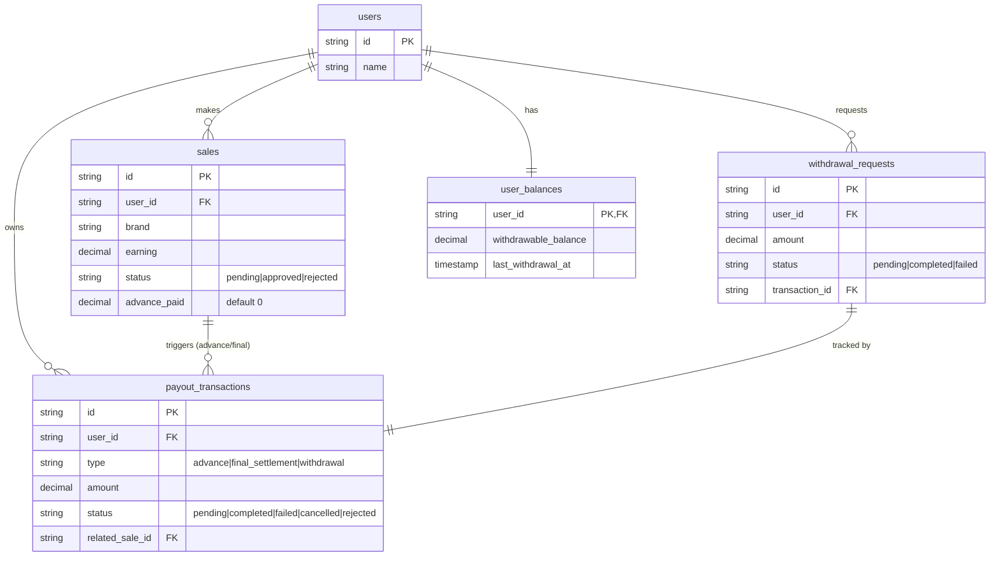
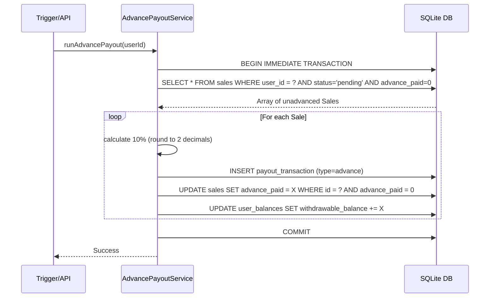
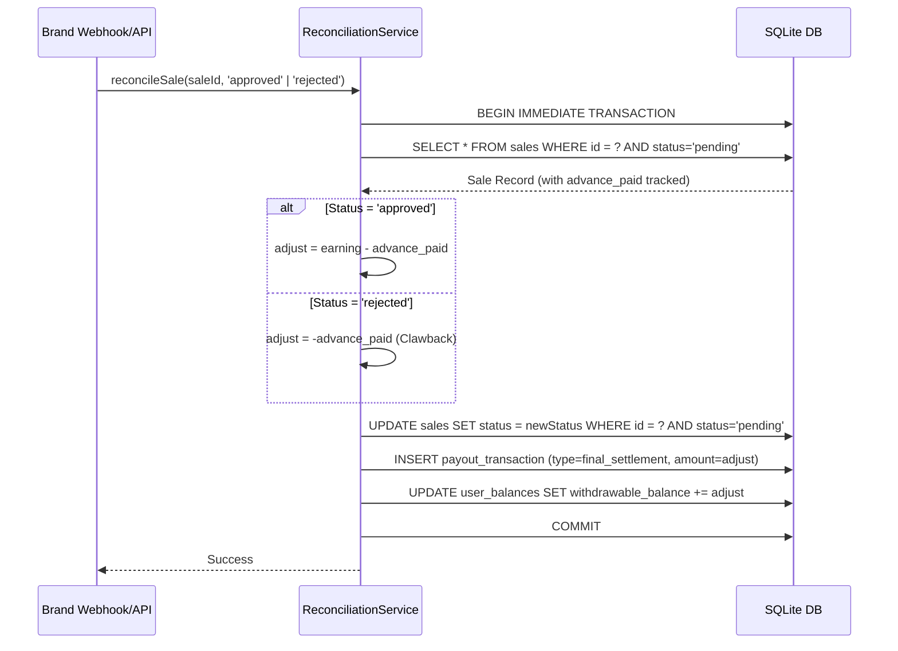

# Low-Level Design (LLD) - Affiliate Payout Engine

This document details the Low-Level Design of the User Payout Management System. It outlines the schema, entity relationships, domain class structures, flow sequence diagrams, and fundamental design decisions that govern the payout processing pipeline.

---

## 1. Database Schema & Entity Relationships

The data model is fundamentally relational, acting as a ledger system.

### **Entity Relationship Diagram (ERD)**

---

## 2. Class Responsibilities

The system is structured using a standard 3-tier architecture separating the REST API (routes), Business Logic (Services), and Data Access (Repositories).

### **Repositories (Persistence Layer)**
- `SaleRepository`: Handles CRUD for `sales`. Contains business-specific queries like `findPendingUnadvanced(userId)` to fetch pending sales where `advance_paid = 0`.
- `UserBalanceRepository`: Manages the atomic balance table. Includes safe upsert (`createOrUpdate`) operations to prevent race conditions during first-time advances.
- `PayoutTransactionRepository`: Append-only (mostly) ledger of all financial movements for an affiliate.
- `WithdrawalRepository`: Tracks specific withdrawal requests and their metadata.

### **Services (Business Logic Layer)**
- `AdvancePayoutService`: Computes the 10% advance for unadvanced pending sales. Credits `user_balances.withdrawable_balance` and records `advance` payout_transactions. Guaranteed to be idempotent.
- `ReconciliationService`: Transitions a sale from `pending` -> `approved|rejected`. Computes final adjustment (`earning - advance_paid` or `-advance_paid`). Adjusts `withdrawable_balance` and records a `final_settlement` transaction.
- `WithdrawalService`: Guards against insufficient balances and the 24-hour cooldown constraint. Deducts from `withdrawable_balance`, updates `last_withdrawal_at`, and stages a `withdrawal` transaction.
- `FailedPayoutRecoveryService`: Triggers when external payment gateways reject a payout. Refunds the `withdrawable_balance` and resets `last_withdrawal_at` to unblock the user immediately.

---

## 3. Sequence Diagrams

### **Advance Payout Flow**
This flow represents the scheduled or triggered job that grants the 10% advance.

### **Reconciliation Flow**
This flow occurs when the brand validates a tracked sale as either legitimate (approved) or fraudulent/returned (rejected).

---

## 4. Key Design Decisions & Trade-offs

### **1. Why SQLite?**
SQLite was chosen for this localized LLD assignment due to its zero-configuration footprint and phenomenal support for standard SQL transactions. By using `BEGIN IMMEDIATE TRANSACTION`, SQLite enforces sequential writes, safely guarding against concurrency bugs (race conditions) without complex distributed locking mechanisms like Redis.

### **2. Idempotency via Row Flag vs. Transaction Aggregation**
To enforce idempotency for advance payouts, we track `advance_paid` directly on the `sales` row rather than scanning the entire `payout_transactions` table to sum previous advances.
- **Trade-off:** Denormalizes state slightly.
- **Benefit:** Massive performance gain. `SELECT * FROM sales WHERE advance_paid = 0` requires a simple index, whereas aggregating transaction history requires a full table scan or expensive grouping, which would bottleneck the scheduled job engine as the ledger grows indefinitely.

### **3. Derived Balance Table vs. Computing on Read**
Instead of calculating the user's available balance by dynamically `SUM()`ing their entire transaction ledger on every API request, we maintain a strictly synchronized `user_balances` table.
- **Trade-off:** Requires rigorous transactional boundaries to guarantee the `user_balances` table never falls out of sync with `payout_transactions`. 
- **Benefit:** `O(1)` constant time complexity for balance lookups and withdrawal validation. This ensures the `/withdrawals` and `/balance` endpoints remain ultra-fast regardless of how many thousands of historical transactions an affiliate generates.

### **4. Rounding Strategy**
We utilize standard JavaScript `Math.round(amount * 100) / 100` rounding (2 decimals, nearest cent). This ensures floating point arithmetic doesn't result in infinitesimal imbalances (e.g., `0.30000000000000004`). In a strict production system, integer-based micro-cents (storing `33` instead of `0.33`) would be utilized for absolute precision.

### **5. Cooldown Reset on Failure**
Users are restricted to 1 withdrawal per 24 hours to mitigate external payout fee bleeding. However, if a payout request fails asynchronously (e.g., rejected by bank), the `FailedPayoutRecoveryService` explicitly resets `last_withdrawal_at = NULL` in the DB.
- **Trade-off:** Minor code complexity for handling failure edges.
- **Benefit:** Phenomenal UX. We intentionally choose **not to penalize the user** for infrastructural or banking failures outside their control, allowing them to re-attempt the withdrawal immediately upon refund.
